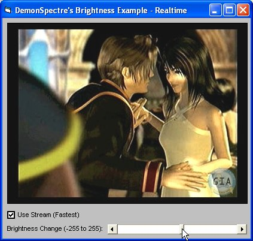



## From PSet to DIB Sections: complete VB Graphics Tutorials \- Revised 13/July/2006

### Description

Sorry to everyone for re-uploading this as "new"...somehow the old .zip got lost in the moderation.

Anyway, for those who don't know - these tutorials cover all aspects of per-pixel interfacing in VB. Included in the tutorial are sections on Point/PSet, Get/SetPixel/V, Get/SetBitmapBits, and Get/StretchDIBits. Speed comparisons and an extra page on general graphics optimizations is included. The tutorials have been completely reformatted and updated with a new section on 4-bit alignment in DIB section width, as well as information on SafeArrays and graphics programming. Comments are welcome!
 
### More Info
 

             |
---                |---
**Submitted On**   |2006-07-13 12:12:08
**By**             |[Tanner H](https://github.com/Planet-Source-Code/PSCIndex/blob/master/ByAuthor/tanner-h.md)
**Level**          |Beginner
**User Rating**    |5.0 (45 globes from 9 users)
**Compatibility**  |VB 4\.0 \(32\-bit\), VB 5\.0, VB 6\.0
**Category**       |[Graphics](https://github.com/Planet-Source-Code/PSCIndex/blob/master/ByCategory/graphics__1-46.md)
**World**          |[Visual Basic](https://github.com/Planet-Source-Code/PSCIndex/blob/master/ByWorld/visual-basic.md)
**Archive File**   |[From\_PSet\_2006507142006\.zip](https://github.com/Planet-Source-Code/tanner-h-from-pset-to-dib-sections-complete-vb-graphics-tutorials-revised-13-july-2006__1-65964/archive/master.zip)

### API Declarations

See description

